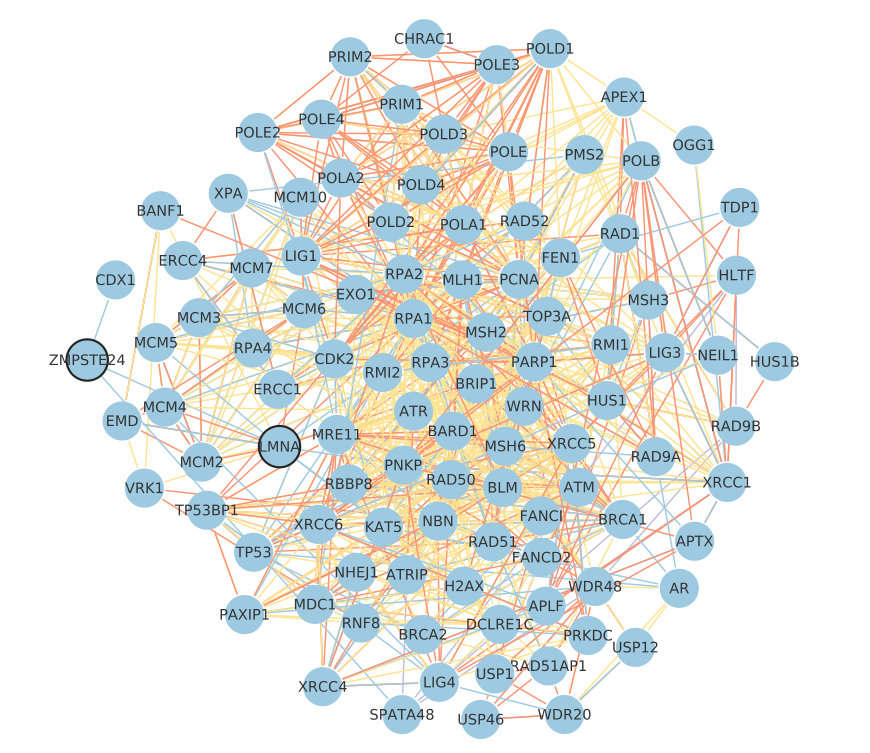

# Identification, clustering and enrichment of communities identified in a multiplex network: application to Premature Aging diseases 

This repository presents the pipeline allowing to:
* Identify communities associated with Premature Aging (PA) diseases, using iterative Random Walk with Restart on a multiplex biological network  
* Perform a clustering of the obtained communities based on computing a Jaccard index between pairs of communities
* Perform enrichment analyses at the level of communities or at the level of clusters, using biological or phenotype annotations

Here, we focus our analysis on Premature Aging diseases. We identified the network communities associated with each Premature Aging disease using their associated causative gene(s) (described in ORPHANET) as seed(s) to perform an iterative Random Walk with Restart (itRWR) in a multiplex network. 

The itRWR algorithm we developed is available as a Python package on GitHub: https://github.com/anthbapt/itRWR. It is based on the MultiXrank Python package. 

This pipeline can be used and/or adapted to any study dedicated to the identification of communities in a multiplex network and follow-up enrichment analyses.



*Caption: Community idenfitied for Hutchinson-Gilford Progeria Syndrome in a multiplex network of biological interactions*

## Folders

* ```_00_data```: Folder containing the data files needed for the analysis (disease identifiers files, gmt files and some output files used in different steps of the analysis)
* ```_01_Community_Identification```: Folder containing codes for the community identification using itRWR. It contains a multiplex biological network composed of 4 layers: Protein-protein interactions, Molecular complexes, Pathways and Coexpression networks. 
These networks are also available on the NDEx server: https://www.ndexbio.org/index.html#/search?searchType=All&searchString=cecile.beust&searchTermExpansion=false. 
The codes allowing to build these networks are available on GitHub: https://github.com/CecileBeust/Networks_building

* ```_02_Analysis_Communities```: Folder containing codes to analyze communities and generate files to visualize them in Cytoscape

* ```_03_Cluster_Communities```: Folder containing the codes to perform a clustering of communities based on the Jaccard index.

* ```_04_Enrichment_BioAnnotations```: Folder containing the codes to perform enrichment analysis at the level of communities or at the level of clusters, using biological annotations.

* ```_05_Enrichment_PhysioAging_Genes```: Folder containing the codes to perform enrichment analysis at the level of clusters using physiological aging gene annotations.

* ```_06_Enrichment_Phenotypes```: Folder containing codes to perform enrichment analysis at the level of clusters using phenotype annotations

* ```Tests```: Folder containing a test file to check the results of the community identification algorithm.

## Usage

The usage of each script is detailed in the corresponding folders. The codes provided here are adapted to the study of Premature Aging diseases identified with their ORPHANET identifiers. It is possible to adapt the codes to other use-cases. 

## References

* Baptista, A., Gonzalez, A. & Baudot, A. Universal multilayer network exploration by ran-
dom walk with restart. en. Communications Physics 5, 170. ISSN: 2399-3650. doi:10 .
1038/s42005-022-00937-9 (July 2022).


* Köhler, S. et al. The Human Phenotype Ontology in 2017. en. Nucleic Acids Research 45,
D865–D876. ISSN: 0305-1048, 1362-4962. doi:10.1093/nar/gkw1039 (Jan. 2017).

* Rath, A. et al. Representation of rare diseases in health information systems: The orphanet approach to serve a wide range of end users. Human Mutation 33, 803–808. ISSN:10597794. doi:10.1002/humu.22078 (2012).

* Raudvere, U. et al. g:Profiler: a web server for functional enrichment analysis and con-
versions of gene lists (2019 update). en. Nucleic Acids Research 47, W191–W198. ISSN:
0305-1048, 1362-4962. doi:10.1093/nar/gkz369 (July 2019)
