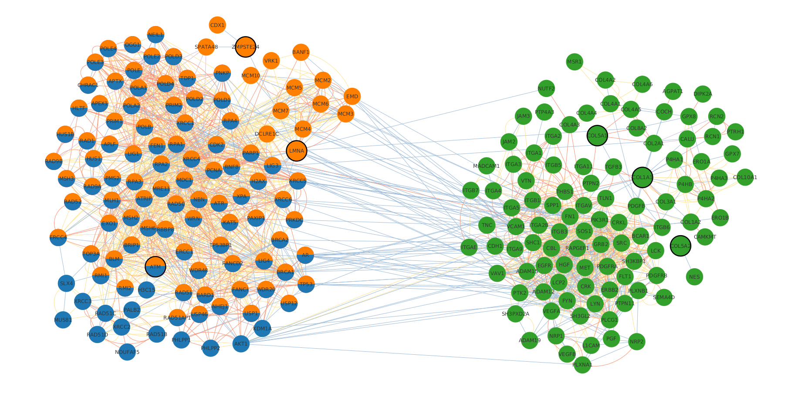

# Analysis and visualization of communities 

This folder contains different scripts to analyze the gene communities identified for Premature Aging diseases. The gene communities have been identified applying an iterative Random Walk with Restart algorithm (itRWR) to a multiplex network of biological interaction.


## Files

* ```analysis_genes_in_communities.py```: contains Python functions to analyze the genes present in the communities
* ```visualization_communities.py```: contains Python functions to generate tabulated files for the visualization of communities in Cytoscape

## Usage

    python analysis_genes_in_communities.py -p /path/where/communities/folders/are/stored

    python visualization_communities.py -p /path/where/communities/folders/are/stored

## Output

The script ```analysis_genes_in_communities``` generates a table containing the genes found in the communities in the ```output_tables``` folder. 
The script ```visualization_communities``` generates tsv files of communities, allowing them to be visualized individually or grouped in Cytoscape. 




## References

* Shannon, P. et al. Cytoscape : A Software Environment for Integrated Models of Biomolec-
ular Interaction Networks. Genome Research 1, 2498–2504. doi:10.1101/gr.1239303.
metabolite (2003).
